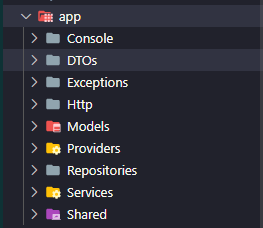

# Folder Struct

## App Folder Struct

### Console

[Link tham khảo][console-reference]

[console-reference]: https://laravel.com/docs/9.x/structure#the-console-directory

### DTOs

bao gồm các class đóng gói data để `chuyển giữa client - server`. Mục đích tạo ra DTO là để giảm bớt lượng info không cần thiết phải chuyển đi, và cũng tăng cường độ bảo mật, giảm thiểu code xử lí trong controle.
