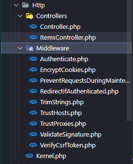

# Folder Struct

## App Folder Struct

### Console

[Link tham khảo][console-reference]

[console-reference]: https://laravel.com/docs/9.x/structure#the-console-directory

### DTOs

Bao gồm các class đóng gói data để `chuyển giữa client - server`. Mục đích tạo ra DTO là để giảm bớt lượng info không cần thiết phải chuyển đi, và cũng tăng cường độ bảo mật, giảm thiểu code xử lí trong controller.

### Exceptions

[Link tham khảo][exceptions-reference]

[exceptions-reference]: https://laravel.com/docs/9.x/structure#the-exceptions-directory

### Http

- `Controllers`
  [Link tham khảo][controlers-reference]

  [controlers-reference]: https://laravel.com/docs/9.x/structure#the-http-directory

  📌 Lưu ý
  `1. Controllers phải đặt tên theo số nhiều.`
  `2. Cố gắng giữ cho bộ điều khiển đơn
giản và bám vào các từ khóa CRUD mặc định(index, create, store, show, edit,
update, destroy).`

- `Middleware`
  [Link tham khảo][middleware-reference]

  [middleware-reference]: https://laravel.com/docs/9.x/structure#the-http-directory
