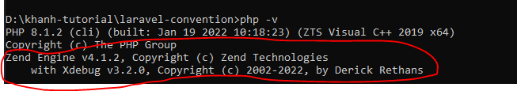

# UNIT TEST CONFIG AND RUN

## Config

1. Run the following command in a terminal\

```php
php -i
```


2. Copy the output of that command and paste it in the [Xdebug Wizard ][xdebug-wizard]. Then click Analyze my phpinfo() output.
   [xdebug-wizard]: https://xdebug.org/wizard
   

3. Once analyzed, the result will tell if you have Xdebug installed or not, and which .dll file to download
   

4. Move the downloaded file to the /ext folder. This is the folder where PHP keeps all of its extensions and can be found under the folder where you have installed PHP. On mine, it is located in C:\PHP\ext.
   
5. Open php.ini file in an editor like Notepad, Notepad++ or Visual Code. This file is located within the folder where you installed PHP, C:\PHP\php.ini for me.
   
6. Check if Xdebug has been installed by running the following command in a terminal

```php
php -v
```



## Run unit test

```php
php artisan test --coverage
```


